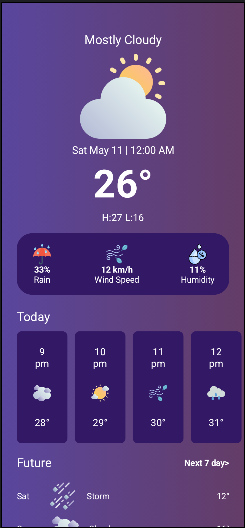

# Weather App

Una aplicación de clima creada con **Kotlin** y **Jetpack Compose** para Android. Muestra el clima actual y el pronóstico para diferentes horas y días, con un diseño moderno y dinámico.

## Características

- **Clima actual**: Muestra la temperatura, la condición meteorológica, la humedad, y la velocidad del viento.
- **Pronóstico por horas**: Visualiza el clima de las próximas horas de manera clara y fácil de entender.
- **Pronóstico futuro**: Muestra el clima previsto para los próximos días.
- **Interfaz dinámica**: Fondo con degradado que varía según las condiciones meteorológicas actuales.
- **Diseño limpio y moderno**: Implementado utilizando las mejores prácticas de Jetpack Compose.

## Tecnologías Utilizadas

- **Kotlin**
- **Jetpack Compose**
- **Android Studio**

